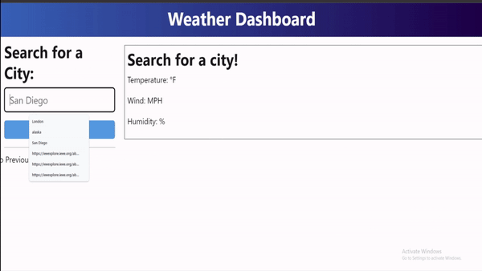
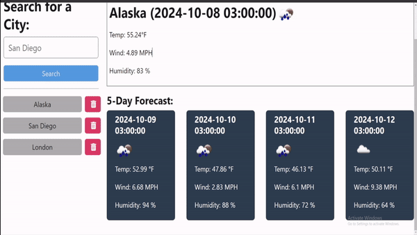
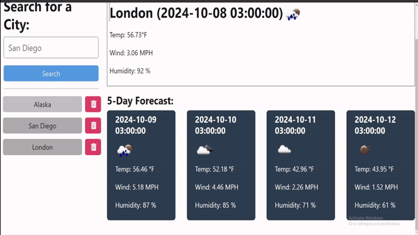

# Weather Forecast
 

[](https://vitejs.dev/)
[](https://expressjs.com/)


## Description

Allows you to see the weather forecast for your city.

## 📁 Table of Contents
- [Installation](#installation)
- [Usage](#usage)
- [Features](#Features)
- [Contributing](#contributing)

## Installation

- If you want to run a server locally on your machine, follow these instructions. If you just want to use the app, go to [this URL](https://weather-forecast-pnck.onrender.com/) and follow the usage instructions
```shell
# Clone this Repository:
git clone https://github.com/Dan-Swarts/weather-forecast.git

# This app requires Node.js to run. Use this command to check if Node.js is locally:
node -v 
# Example output: v20.17.0

# If Node.js isn't installed, follow instructions found here:
# https://nodejs.org/en/learn/getting-started/how-to-install-nodejs

# Install Dependencies:
npm i

# Run the program:
npm run start
```


## Usage

- Follow [this URL](https://weather-forecast-pnck.onrender.com/):
```shell
https://weather-forecast-pnck.onrender.com/
```

- Search for a city's weather forecast



## Features


- Use location history




- Delete items from history 




## Questions
If you have any questions about my project, contact me at example@gmail.com. 

Check out my other projects at github.org.


## Contributing

> [!IMPORTANT]
> Whether you have feedback on features, have encountered any bugs, or have suggestions for enhancements, we're eager to hear from you. Your insights help us make the my project library more robust and user-friendly.

Please feel free to contribute by [submitting an issue](https://github.com) or [joining the discussions](https://github.com). Each contribution helps us grow and improve.

We appreciate your support and look forward to making our product even better with your help!

If you created an application or package and would like other developers to contribute it, you can include guidelines for how to do so. The [Contributor Covenant](https://www.contributor-covenant.org/) is an industry standard, but you can always write your own if you'd prefer.